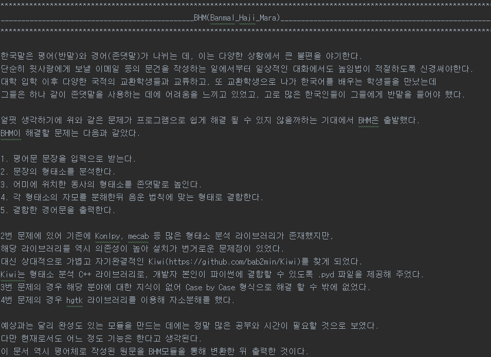
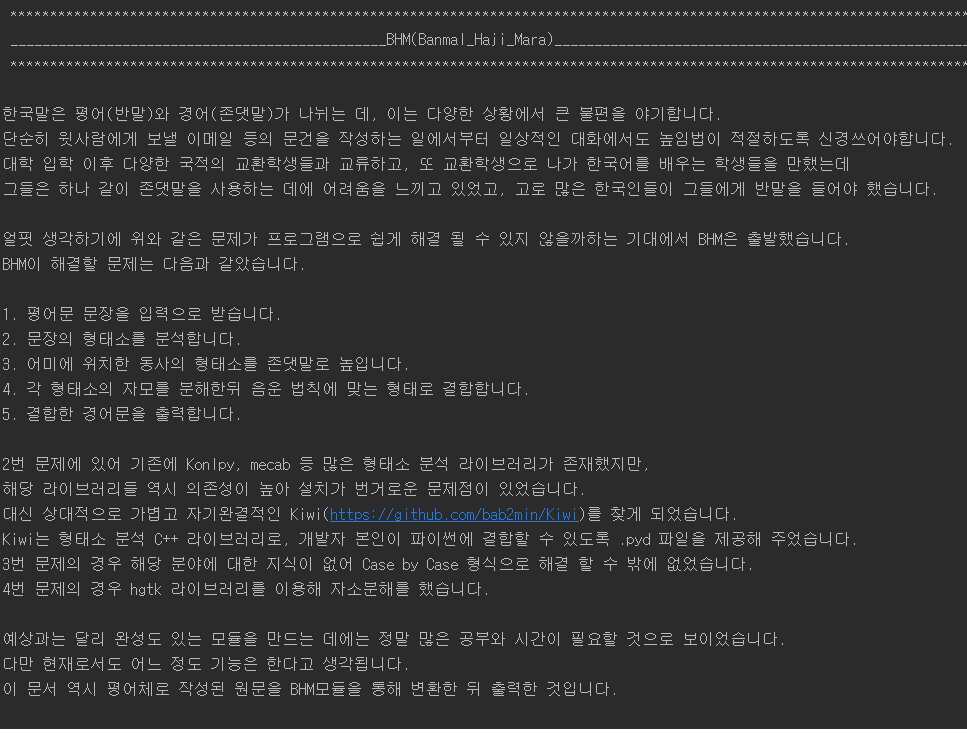

# BHM
**Banmal Haji Mara** : python module converting Korean down talk to honorific talk

BHM 모듈은 반말을 존댓말로 바꾸는 파이썬 모듈입니다. 다음 순서대로 기능합니다.

1. 평어문 문장을 입력으로 받습니다.
2. 문장의 형태소를 분석합니다.
3. 어미에 위치한 동사의asd 형태소를 존댓말로 높입니다.
4. 각 형태소의 자모를 분해한뒤 음운 법칙에 맞는 형태로 결합합니다.
5. 결합한 경어문을 출력합니다.

다음 라이브러리들에 의존합니다.
* [Kiwi](https://github.com/bab2min/Kiwi) : 포함되어 있습니다.
* [hgtk](https://github.com/bluedisk/hangul-toolkit) : pip에서 설치가능합니다.

다음은 test_long의 작동 스크린샷입니다.

* 원문

* 결과

